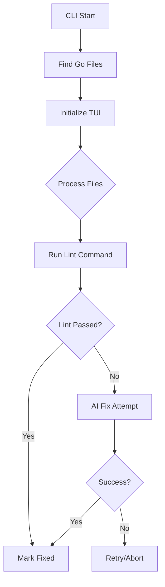

Here's an updated README that better reflects your current implementation:

# DeepRefactor

DeepRefactor is an AI-powered CLI tool that automatically fixes Go linting errors through iterative refactoring. It combines a terminal UI with local Ollama integration to provide an interactive code quality improvement experience.


## Features

- **AI-Powered Fixes**: Uses local Ollama models (default: deepseek-coder-v2) to resolve lint issues
- **Interactive TUI**: Real-time progress tracking with keyboard controls
- **Smart Retries**: Configurable attempt system per file (default: 5 retries)
- **Custom Linting**: Supports any lint command via template injection
- **Contextual Processing**: Maintains directory structure while processing files
- **Parallel Processing**: Concurrent file handling with wait groups

## Prerequisites

- **Go 1.20+**
- **Ollama Server** (running locally)
- **DeepSeek Coder v2 Model** (or other code-aware LLM):
  ```bash
  ollama pull deepseek-coder-v2
  ```

## Installation

```bash
# Clone repository
git clone https://github.com/your-username/DeepRefactor.git
cd DeepRefactor

# Build binary
go build -o deeprefactor

# Install system-wide (optional)
sudo mv deeprefactor /usr/local/bin/
```

## Usage

### Basic Command
```bash
deeprefactor --dir ./src --max-retries 3
```

### Full Options
```bash
deeprefactor \
  --dir ./your-project \          # Target directory (default: .)
  --max-retries 5 \               # Fix attempts per file (default: 5)
  --ollama-url http://localhost:11434 \  # Ollama endpoint
  --model codellama \             # Alternative model
  --lint-cmd "golangci-lint run {{filepath}}"  # Custom lint command
```

### Example Workflow
1. Start Ollama service:
   ```bash
   ollama serve
   ```

2. Run refactoring:
   ```bash
   deeprefactor --dir ./testdata --max-retries 3
   ```

3. Monitor progress in TUI:
   ```
   [Processing] testdata/mistakes.go
   Attempt 2/3 | Last error: undeclared name
   ```

## Architecture



## Configuration Flags

| Flag         | Description                          | Default                       |
|--------------|--------------------------------------|-------------------------------|
| `--dir`      | Target directory                     | . (current)                   |
| `--max-retries` | Maximum fix attempts per file     | 5                             |
| `--ollama-url` | Ollama server URL                 | http://localhost:11434        |
| `--model`    | AI model for refactoring            | deepseek-coder-v2             |
| `--lint-cmd` | Lint command template                | `golangci-lint run {{filepath}}` |

## Implementation Details

### AI Integration
The tool uses a structured prompt template:
```go
prompt := fmt.Sprintf(`Fix Go lint errors in %s:
%s

File content:
%s

Return only fixed code with [DeepRefactor] comments. No explanations.`, ...)
```

### Error Handling
- Exponential backoff between retries
- Context timeouts (5 minutes/file)
- Concurrent safety with mutex locks
- Error streaming to TUI

### TUI Features
- Real-time file status updates
- Scrollable log view
- Progress percentage
- Keyboard shortcuts:
  - ↑/↓: Navigate files
  - Enter: Focus logs
  - q: Quit

## Roadmap

- [ ] Multi-file context awareness
- [ ] Interactive conflict resolution
- [ ] Batch processing mode
- [ ] Model response caching
- [ ] Custom prompt templates
- [ ] CI/CD integration

## Troubleshooting

Common Issues:
1. **Model Not Responding**:
   - Verify Ollama service is running
   - Check model download completion
   ```bash
   ollama list
   ```

2. **Lint Command Failures**:
   - Test your lint command directly
   - Ensure template contains `{{filepath}}`

3. **Partial Fixes**:
   - Increase max retries
   - Try different models
   ```bash
   deeprefactor --model starcoder --max-retries 7
   ```

## Acknowledgments

- [Ollama](https://ollama.ai) - Local LLM infrastructure
- [Bubble Tea](https://github.com/charmbracelet/bubbletea) - TUI framework
- [DeepSeek](https://deepseek.com) - Code-optimized AI models
